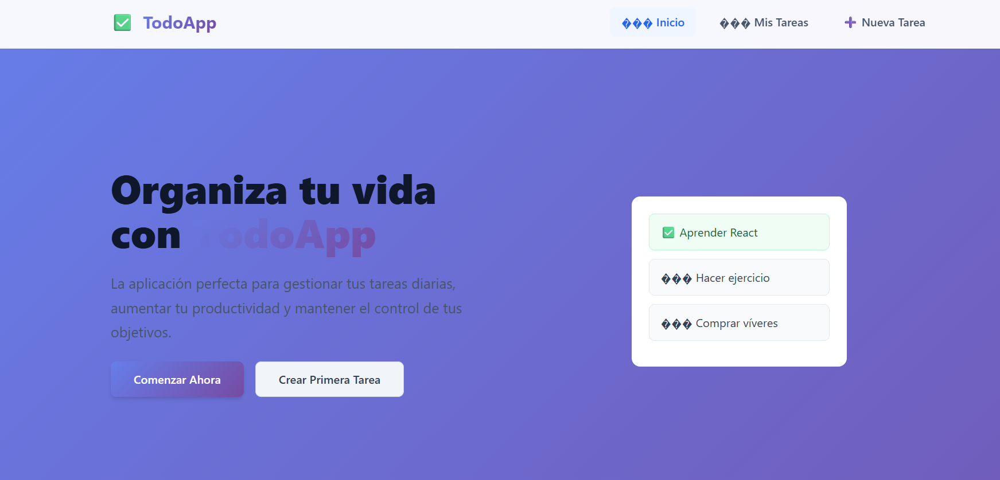
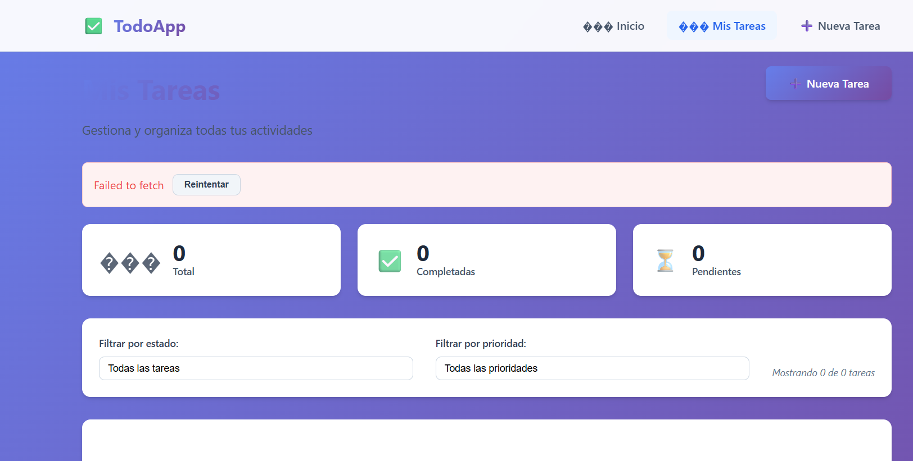

# 📝 Todo App - Gestor de Tareas

Una aplicación moderna de gestión de tareas construida con **React**, **React Router** y **API REST**. Perfecta para organizar tus actividades diarias y aumentar tu productividad.

## Capturas del Proyecto

## 🚀 Características Implementadas

### ✅ Requisitos Principales

- **🏗️ Navegación entre páginas** - React Router configurado
- **➕ Crear nuevos todos** - Formulario con validación
- **📋 Listar todos existentes** - Consumo de API REST
- **✅ Marcar como completado/pendiente** - Toggle funcional
- **🗑️ Eliminar todos** - Con confirmación de usuario
- **🔍 Validación básica de formularios** - En tiempo real
- **⏳ Estados de carga** - Feedback durante peticiones
- **🚨 Manejo básico de errores** - Try/catch con mensajes

### 🏆 Retos Completados

- **✏️ Editar todos** - Formulario completo de edición
- **🔧 Filtros** - Por estado y prioridad con contadores

## 🛠️ Tecnologías Utilizadas

- **React 18.2.0** - Biblioteca de interfaz de usuario
- **React Router DOM 6.8.0** - Navegación entre páginas
- **Vite 4.1.0** - Herramienta de build y desarrollo
- **JSON Server 0.17.3** - API REST falsa para desarrollo
- **CSS3** - Estilos con variables personalizadas

## 📦 Instalación y Ejecución

### Prerrequisitos

- Node.js 16 o superior
- npm o yarn

### Pasos para ejecutar

1. **Clonar el repositorio**
   git clone https://github.com/tu-usuario/todo-app.git
   cd todo-app
   Instalar dependencias

npm install
Ejecutar la aplicación (necesitas dos terminales)

Terminal 1 - Servidor API:

npm run server
API disponible en: http://localhost:3001

Terminal 2 - Aplicación React:

npm run dev
Aplicación disponible en: http://localhost:5173

🎮 Cómo Usar la Aplicación
Páginas Disponibles
Página Ruta Descripción
🏠 Inicio / Página de bienvenida con información
📝 Mis Tareas /todos Lista completa de tareas con filtros
➕ Nueva Tarea /add Formulario para crear tareas
✏️ Editar Tarea /edit/:id Formulario para modificar tareas
Funcionalidades por Página
📝 Mis Tareas (/todos)
Ver todas las tareas

Estadísticas (total, completadas, pendientes)

Filtros por estado: Todas, Pendientes, Completadas

Filtros por prioridad: Alta, Media, Baja

Acciones: Editar, Eliminar, Marcar completado

➕ Nueva Tarea (/add)
Formulario con validación en tiempo real

Vista previa de la tarea

Selección de prioridad

Contadores de caracteres

Mensajes de error descriptivos

✏️ Editar Tarea (/edit/:id)
Carga automática de datos existentes

Modificación de todos los campos

Posibilidad de marcar como completada

Información adicional de la tarea

🗂️ Estructura del Proyecto
text
todo-app/
├── src/
│ ├── components/ # Componentes reutilizables
│ │ ├── Header.jsx # Navegación principal
│ │ ├── TodoItem.jsx # Item de tarea individual
│ │ ├── TodoForm.jsx # Formulario reutilizable
│ │ ├── Filters.jsx # Componente de filtros
│ │ └── Loading.jsx # Estados de carga
│ ├── pages/ # Páginas de la aplicación
│ │ ├── Home.jsx # Página de inicio
│ │ ├── Todos.jsx # Lista de tareas
│ │ ├── AddTodo.jsx # Crear tarea
│ │ ├── EditTodo.jsx # Editar tarea
│ │ └── NotFound.jsx # Página 404
│ ├── services/ # Lógica de negocio
│ │ ├── api.js # Servicios de API REST
│ │ └── validation.js # Sistema de validaciones
│ ├── hooks/ # Hooks personalizados
│ │ ├── useTodos.js # Gestión de tareas
│ │ └── useForm.js # Gestión de formularios
│ ├── styles/ # Archivos de estilos
│ │ ├── globals.css # Variables globales
│ │ ├── components.css # Estilos de componentes
│ │ └── utils.css # Utilidades y páginas
│ ├── App.jsx # Componente principal
│ └── main.jsx # Punto de entrada
├── db.json # Base de datos JSON
├── package.json # Dependencias del proyecto
└── README.md # Este archivo
🔌 API Endpoints
La aplicación consume una API REST con los siguientes endpoints:

Método Endpoint Descripción
GET /todos Obtener todas las tareas
GET /todos/:id Obtener tarea específica
POST /todos Crear nueva tarea
PUT /todos/:id Actualizar tarea completa
PATCH /todos/:id Actualización parcial
DELETE /todos/:id Eliminar tarea
Ejemplo de Estructura de Tarea
json
{
"id": 1,
"title": "Aprender React Router",
"description": "Estudiar navegación en React",
"completed": false,
"priority": "high",
"createdAt": "2024-01-15T10:00:00Z"
}
🎨 Características de UI/UX
Prioridades
🔴 Alta - Tareas urgentes e importantes

🟡 Media - Tareas importantes

🟢 Baja - Tareas normales

Estados
✅ Completada - Texto tachado, opacidad reducida

⏳ Pendiente - Estado normal

Validaciones
Título: Requerido, mínimo 3 caracteres, máximo 100

Descripción: Opcional, máximo 500 caracteres

Prioridad: Selección entre alta, media, baja

📱 Responsive Design
La aplicación está optimizada para:

💻 Desktop - Experiencia completa

📱 Mobile - Navegación optimizada

🖥️ Tablet - Layout adaptativo

🚀 Scripts Disponibles
bash
npm run dev # Servidor de desarrollo
npm run server # JSON Server (API)
npm run build # Build para producción
npm run preview # Vista previa del build
📊 Commits Realizados
feat: creación de estructura inicial con rutas /, /todos y /add

feat: configuración de React Router y componentes base

feat: componente Todos.jsx con fetch inicial usando useEffect

feat: implementación de listado de todos desde API REST

feat: formulario para crear nuevos todos con validación básica

feat: función para marcar todos como completado o pendiente

feat: función para eliminar todos del listado con confirmación

feat: estados de carga y mensajes de espera con useState

feat: manejo básico de errores en peticiones con try/catch

refactor: separación de lógica en componentes y limpieza de código

feat: implementación completa de edición de todos con formulario

feat: sistema de filtros por estado y prioridad implementado

👨‍💻 Autor
Pablo
Desarrollado como parte de la actividad GA1-220501096-03-AA1-EV10

📄 Licencia
Este proyecto es con fines educativos.
